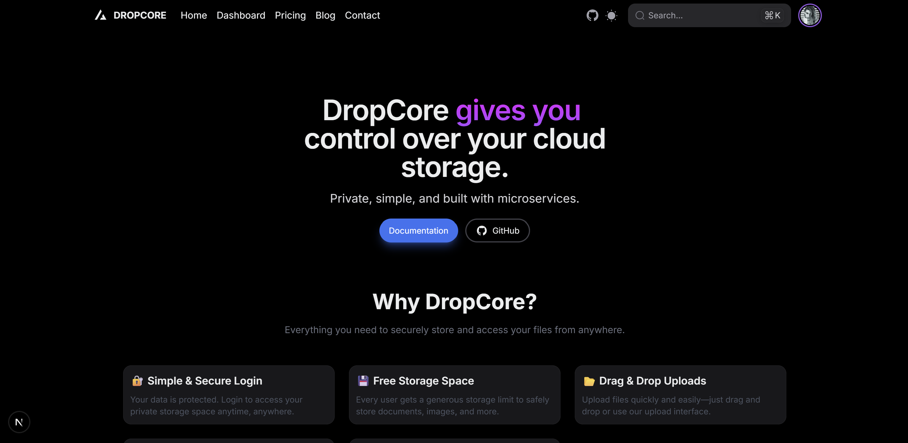
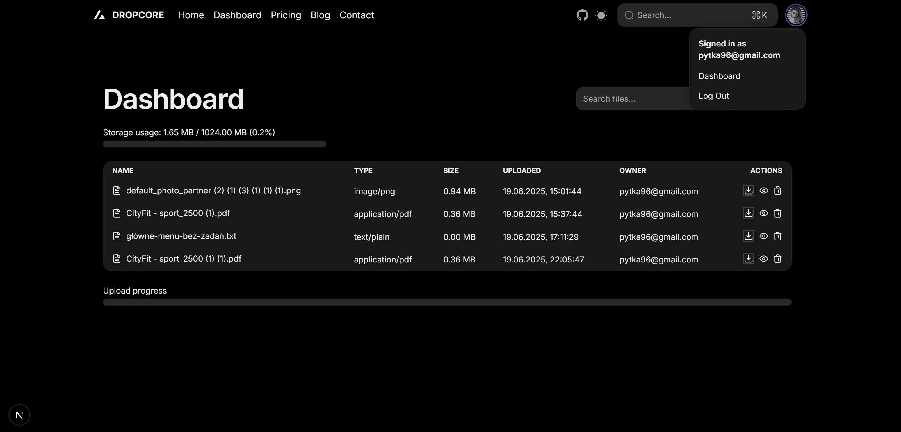

# 🎨 Dropcore – Frontend

Dropcore's frontend is a user interface built with **React** and **Hero.UI**. It allows users to register, log in, upload, preview, download, and delete files. It also includes basic static pages like a landing page, contact, blog, and pricing.

---

## 🖼️ Screenshots

### 🔹 Landing Page


### 🔹 Dashboard View


---

## 🧩 Technologies & Stack

- **React (Next.js)** – app routing and page structure
- **Hero.UI** – modern UI component library built on Tailwind CSS
- Fetch API for REST communication with backend services via `.env` variables
- Routing: React Router or framework-integrated (e.g., Next.js)
- Async/await and modular API wrappers

---

## 🧭 Features / User Flow

- **Landing Page** – informational intro to the project
- **Authentication** – user registration and login
- **Dashboard** – file listing view:
  - See filenames, upload date, and preview supported types (images, PDFs)
  - Upload new files
  - Delete and download files
- **File Preview** – open supported files inline (images, PDF)
- Static Pages: Contact, Blog, Pricing

---

## ⚙️ How to Run

1. Install dependencies:

```bash
npm install
```

2. Create a `.env.local` file with the following content:

```
NEXT_PUBLIC_AUTH_SERVICE_URL=http://localhost:8000
NEXT_PUBLIC_FILE_SERVICE_URL=http://localhost:5002
NEXT_PUBLIC_USER_SERVICE_URL=http://localhost:5004
NEXT_PUBLIC_VIEWER_SERVICE_URL=http://localhost:5005
```

3. Start the development server:

```bash
npm run dev
```

The app will be available at `http://localhost:3000`.

---

## 🗂️ Project Structure

```
/src
├── app              # App-level routing & layout logic (Next.js)
├── components       # Reusable UI components
├── config           # App configuration
├── lib              # API functions (e.g., registerUser, fetchFiles)
├── styles           # Tailwind & global styles
├── types            # TypeScript type definitions
```

---

## 🧪 Example API Integration

From `lib/auth/registerUser.ts`:

```ts
export async function registerUser({
  email,
  username,
  password,
}: {
  email: string;
  username: string;
  password: string;
}): Promise<void> {
  const baseUrl = process.env.NEXT_PUBLIC_AUTH_SERVICE_URL;

  if (!baseUrl) {
    throw new Error("Missing NEXT_PUBLIC_AUTH_SERVICE_URL in .env.local");
  }

  const res = await fetch(`${baseUrl}/auth/register`, {
    method: "POST",
    headers: {
      "Content-Type": "application/json",
    },
    body: JSON.stringify({ email, username, password }),
  });

  if (!res.ok) {
    const msg = await res.text();
    throw new Error(msg || "Registration failed");
  }
}
```

Similar functions exist for login, file upload, deletion, and retrieval.

---

## 👤 Author

Developed as a semester project for the **Information Systems Management** course.

Repository: [github.com/Fablek/dropcore-frontend](https://github.com/Fablek/dropcore-frontend)

---

## ✅ Optional Improvements

- Integrate fully with the backend and test all user flows
- Add unit tests (e.g., using React Testing Library)
- Set up a basic CI/CD pipeline for linting, build, and deployment
